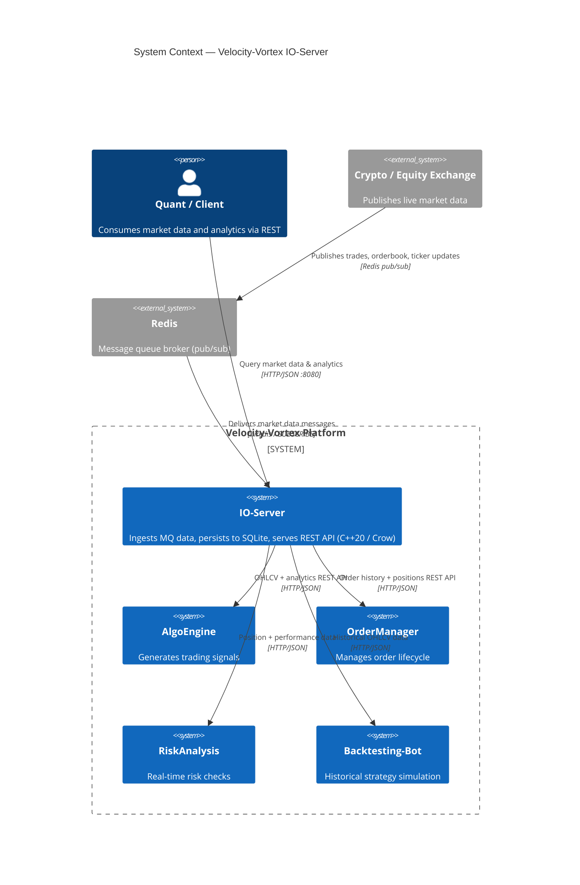
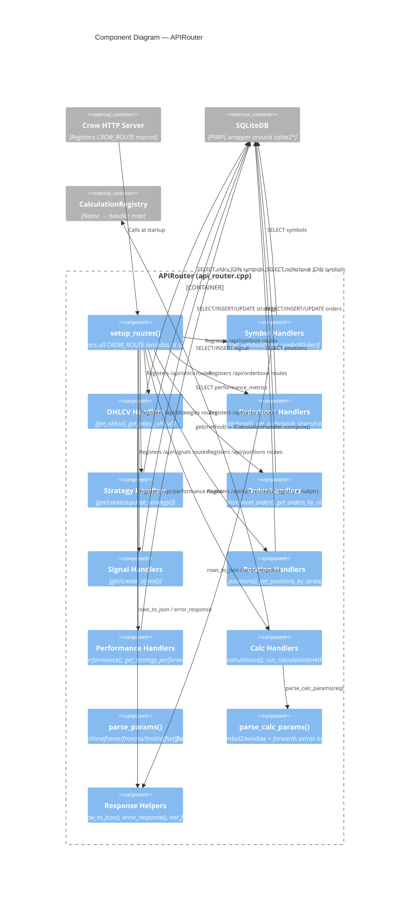
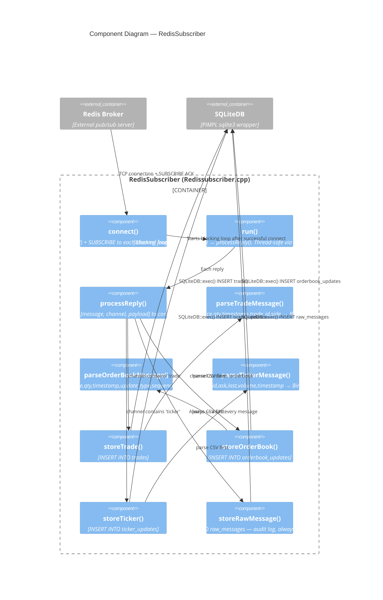
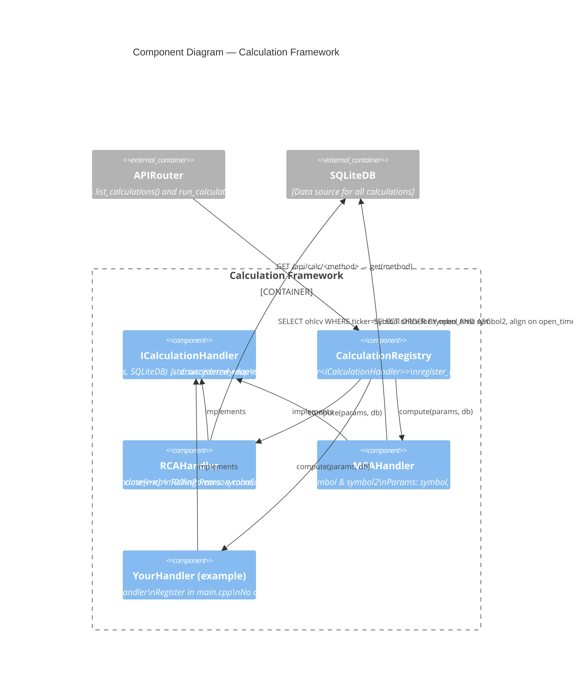

# C4 Architecture Diagrams — Velocity-Vortex IO-Server

Three levels: System Context → Container → Component.  
All diagrams use the [C4-PlantUML](https://github.com/plantuml-stdlib/C4-PlantUML) style
rendered as Mermaid `C4Context` / `C4Container` / `C4Component` blocks.

---

## Level 1 — System Context



---

## Level 2 — Container

```mermaid
C4Container
    title Container Diagram — IO-Server

    System_Ext(redis, "Redis 7", "Pub/sub message broker")
    Person(client, "API Consumer", "AlgoEngine / Risk / Trader")

    System_Boundary(io, "IO-Server Process  (IOBroker.exe)") {

        Container(http_server, "HTTP Server", "Crow C++ Framework",
            "Listens on :8080, routes all REST requests")

        Container(api_router, "APIRouter", "C++ class",
            "Implements every /api/* route handler. Dispatches calc requests to CalculationRegistry")

        Container(calc_registry, "CalculationRegistry", "C++ class",
            "Plugin registry: maps method name → ICalculationHandler. Extensible without changing router")

        Container(rca, "RCAHandler", "ICalculationHandler",
            "Rate of Change Analysis — momentum over rolling window")

        Container(mca, "MCAHandler", "ICalculationHandler",
            "Moving Correlation Analysis — Pearson correlation between two symbols")

        Container(redis_sub, "RedisSubscriber", "C++ class / detached thread",
            "Subscribes to Redis channels, parses CSV messages, writes to SQLite. Optional — server runs without it")

        ContainerDb(sqlite, "SQLite Database", "velocity_vortex.db",
            "All time-series and relational data. 12 tables. WAL mode, 64 MB cache")
    }

    Rel(redis, redis_sub, "Push messages", "hiredis blocking redisGetReply()")
    Rel(redis_sub, sqlite, "INSERT trades / orderbook_updates / ticker_updates / raw_messages", "SQLiteDB::exec()")

    Rel(client, http_server, "GET /api/*", "HTTP :8080")
    Rel(http_server, api_router, "Dispatch request")
    Rel(api_router, sqlite, "SELECT / INSERT / UPDATE", "SQLiteDB::query() / exec()")
    Rel(api_router, calc_registry, "Lookup + invoke handler", "/api/calc/<method>")
    Rel(calc_registry, rca, "compute(CalcParams, SQLiteDB)")
    Rel(calc_registry, mca, "compute(CalcParams, SQLiteDB)")
    Rel(rca, sqlite, "SELECT ohlcv", "SQLiteDB::query()")
    Rel(mca, sqlite, "SELECT ohlcv × 2 symbols", "SQLiteDB::query()")
```

---

## Level 3 — Component (APIRouter)



---

## Level 3 — Component (RedisSubscriber)



---

## Level 3 — Component (Calculation Framework)


